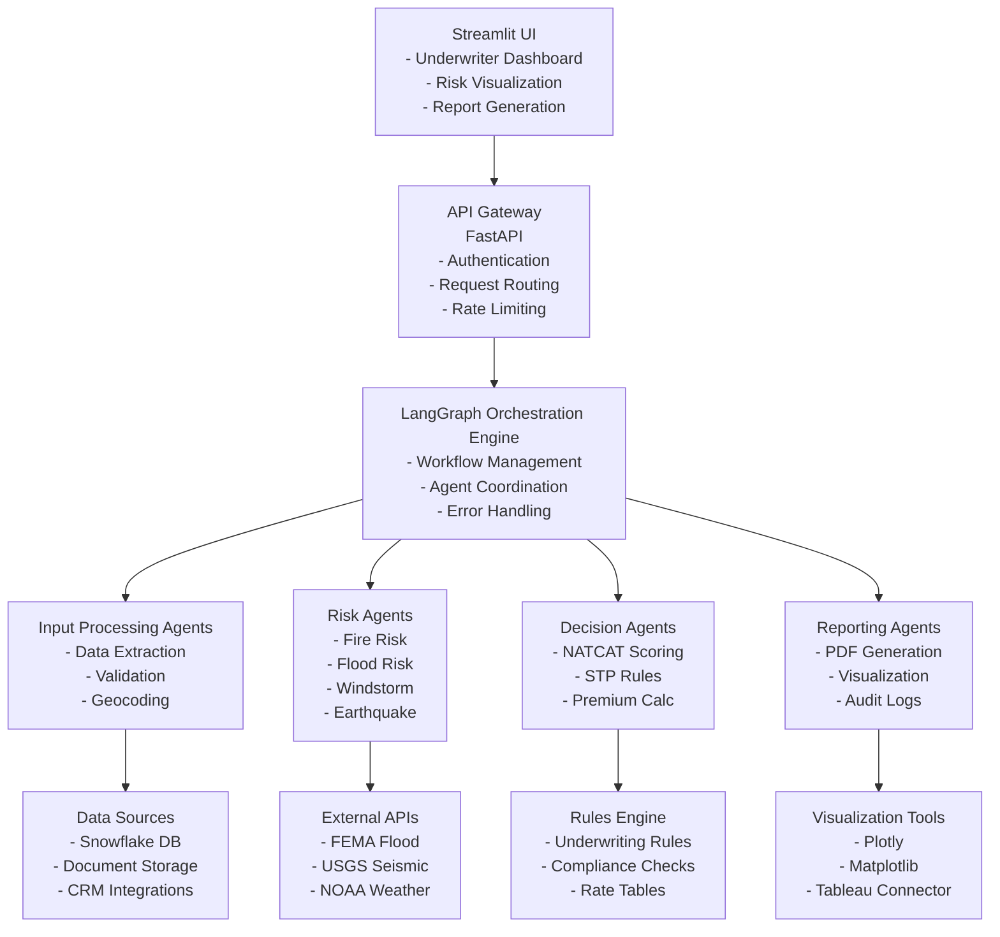
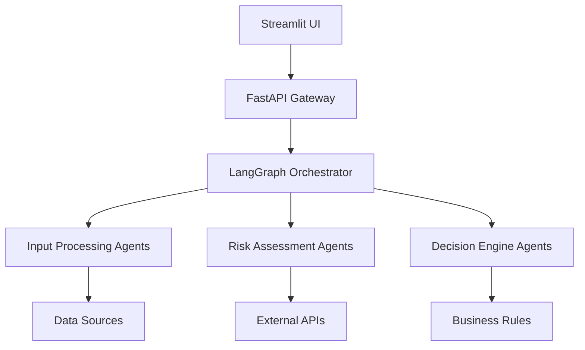

# InsurIQ
- InsurIQ: AI-Powered House Insurance Underwriting System
- A smart, location-aware underwriting tool combining natural hazard analysis and property data for insurance decisions.

# InsurIQ - AI-Powered House Insurance Underwriting System

## Table of Contents
1. [Objectives](#objectives)
2. [System Architecture](#system-architecture)
3. [Component Flow](#component-flow)
4. [Data Flow](#data-flow)
5. [Tech Stack](#tech-stack)
6. [Component Responsibilities](#component-responsibilities)
7. [Future Enhancements](#future-enhancements)
8. [Getting Started](#getting-started)
9. [License](#license)

## Objectives <a name="objectives"></a>
InsurIQ is designed to:
- Automate property insurance underwriting using AI agents
- Provide comprehensive natural catastrophe (NATCAT) risk assessment
- Reduce manual underwriting workload through STP (Straight Through Processing)
- Improve risk assessment accuracy with multi-factor analysis
- Generate explainable underwriting decisions with audit trails
- Integrate with existing insurance systems and data sources


## InsurIQ Architecture




## System Architecture <a name="system-architecture"></a>


```graph LR
A[Structured Data] --> B[Fire Risk]
A --> C[Flood Risk]
A --> D[Windstorm Risk]
A --> E[Earthquake Risk]
A --> F[Construction Risk]
A --> G[Claims Analysis]
```

## data flow

```aiignore
UI → API → Orchestrator → Agents → Data Sources → Analysis → Decisions → Reports → UI
```

```aiignore
flowchart LR
    RawInput -->|Extract| StructuredData
    StructuredData -->|Enrich| RiskScores
    RiskScores -->|Analyze| UnderwritingDecision
    UnderwritingDecision -->|Generate| Reports
```

## Tech Stack <a name="tech-stack"></a>

| Category          | Technologies                          |
|-------------------|---------------------------------------|
| Core Framework    | Python 3.10, LangGraph, LangChain     |
| UI                | Streamlit                             |
| API Layer         | FastAPI                               |
| Data Processing   | Pandas, NumPy                         |
| Visualization     | Plotly, Matplotlib                    |
| Vector Database   | FAISS                                 |
| LLM Integration   | OpenAI GPT-4                          |
| External APIs     | FEMA, USGS, NOAA                      |
| Data Storage      | Snowflake                             |

## Component Responsibilities <a name="component-responsibilities"></a>

### Input Processing Agents

| Agent            | Responsibility                          |
|------------------|----------------------------------------|
| ReadInput        | Extract data from various sources      |
| AddressGeocoder  | Convert addresses to coordinates       |
| DataValidator    | Verify input completeness              |

### Risk Assessment Agents

| Agent            | Risk Factors Evaluated                 |
|------------------|----------------------------------------|
| FireRisk         | Fire station proximity, wildfire       |
| FloodRisk        | FEMA zones, basement presence          |
| WindstormRisk    | Hurricane, tornado, hail               |
| EarthquakeRisk   | Seismic activity, soil type            |
| ConstructionRisk | Building materials, year built         |

## Future Enhancements <a name="future-enhancements"></a>

### Immediate Priorities
- [ ] Integration with more property data providers
- [ ] Mobile-friendly underwriter dashboard
- [ ] Automated document processing for PDFs/images

### Long-Term Roadmap (12+ months)
- [ ] IoT device integration for real-time monitoring
- [ ] Climate change impact modeling
- [ ] Blockchain-based policy management


### Getting Started
```aiignore
git clone https://github.com/yourorg/insuriq.git
cd insuriq
pip install -r requirements.txt
streamlit run insur_iq_app.py
```